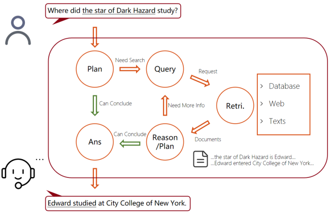

## Eco_RAG

> Trying to build a well-structured and efficient RAG system (Personal practice).

### Overview

##### structure of the Eco_RAG system:
```
Eco_RAG/
├── .env                    # API keys and secrets (never commit this)
├── data/                   # DateSets or PDFs, text files
├── db/                     # Vector DB storage
└── src/
    ├── __init__.py         # handle interfaces for outer calls
    ├── Config.py           # Centralized configuration (Models, Paths)
    ├── Schema.py           # Defines what a "Document" looks like
    ├── Orchestrator.py     # !Core. Judge overall flow control
    ├── ContextManager.py   # !Core. Manages conversation history
    ├── ChatModel.py        # Handles prompt engineering and LLM calls and what Message or Response looks like
    ├── QueryProcessor.py   # !Core. Handle query. Routing and Rewriting
    ├── Retriever.py        # Retrieves relevant documents from vector DB
    ├── Adapter.py          # !Core. Process query results between Retriever and ChatModel, also iterate query if needed
    └── indexing/
        ├── __init__.py
        ├── Assembler.py    # Handles files process and interaction with vector DB
        └── ...             
├── web_src/                # other language modules
└── config.json             # global config for all languages
```

##### Flow


### TODO
  - [x] Basic Indexing and API calls
  - [x] Chat Client and Prompt Management
  - [ ] Langraph flow control
  - [ ] Memory management and compression
  - [ ] Agentic stage(query) and web search interface
  - [ ] Self evaluation and iteration stage