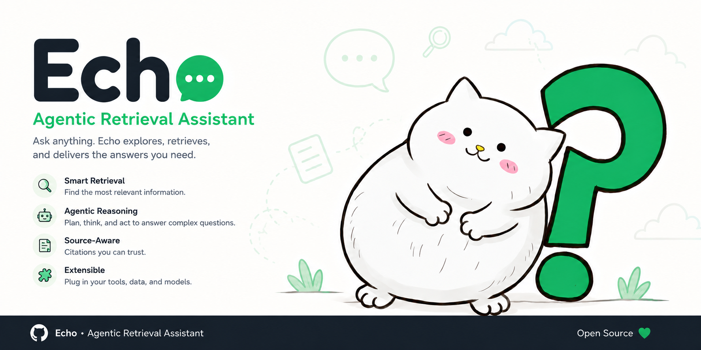
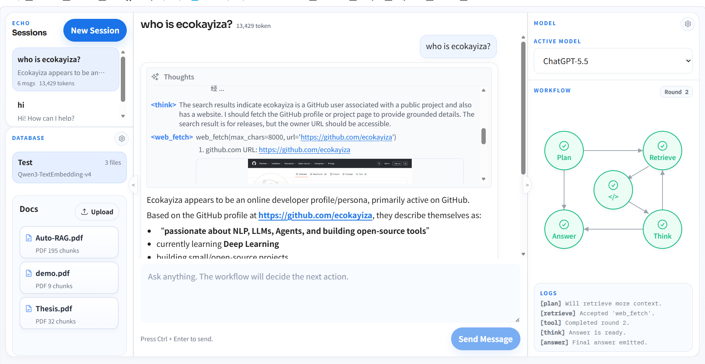
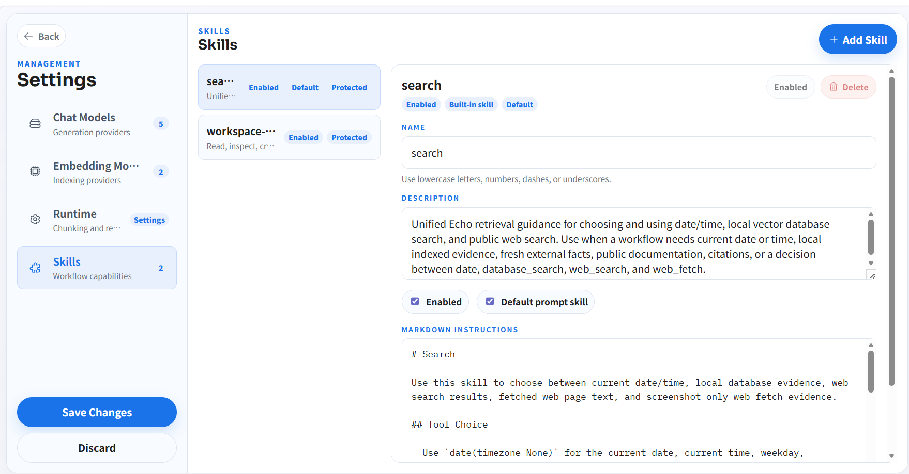
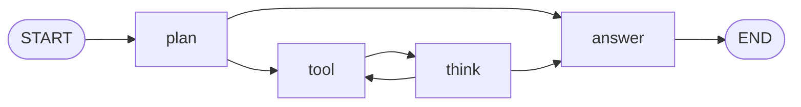

# Echo



Echo is an observable LLM workspace built around chat, tool execution, RAG, and a visible decision workflow.

Instead of treating RAG as a fixed prompt template, Echo runs each user turn through a LangGraph workflow. The model first plans, chooses a tool when more context or an action is needed, executes that tool, thinks over the result, and then streams the final answer back to the UI.





## Highlights

- Chat-first workspace with persistent sessions stored as JSON.
- Observable LangGraph workflow: `plan`, `tool`, `think`, `answer`.
- Live SSE streaming for both internal reasoning records and final answer chunks.
- React + TypeScript + Vite web UI with session, workflow, database, model, runtime, and skill settings.
- FastAPI backend with REST endpoints and streaming chat APIs.
- RAG pipeline with per-database embedding model pairing.
- OpenAI-compatible chat and embedding providers, including local provider endpoints.
- Chroma-backed vector storage under `db/`.
- Document upload and indexing for `.md`, `.txt`, and `.pdf`.
- Optional Marker-powered PDF conversion with PyPDF2 fallback.
- Built-in MCP-style tools for skills, date, database search, web search, web fetch, and bounded workspace files.

## Project Status

Echo is an early local-first LLM workspace. It is useful for experimentation, workflow inspection, and building a personal RAG/chat environment, but the public API and on-disk formats may still change.

The repository currently keeps runtime state local:

- `models.json` stores chat and embedding provider settings.
- `databases.json` stores vector database registry state.
- `db/` stores vector database files.
- `memory/` stores chat sessions, workflow drafts, and generated artifacts.
- `data/` stores uploaded source files and workspace files.

These paths are ignored by Git where appropriate. Treat them as local runtime data.

## Architecture

```text
Echo/
├── apps/
│   ├── api/                  # FastAPI backend
│   ├── desktop/              # Reserved desktop shell
│   └── web/                  # React + TypeScript frontend
├── echo/
│   ├── chat/                 # Chat models, sessions, context, service layer
│   ├── skills/               # Skill catalog and skill settings
│   └── workflow/             # LangGraph graph, nodes, prompts, tracking
├── mcp_server/
│   ├── rag/                  # Loading, chunking, embeddings, vector DB registry
│   └── tools/                # Tool implementations used by the workflow
├── memory/                   # Local session memory and workflow drafts
├── data/                     # Uploads and bounded workspace files
├── db/                       # Chroma/vector database storage
├── tests/
├── models.json               # Local model provider settings, ignored by Git
├── databases.json            # Local database registry, ignored by Git
├── settings.json             # Runtime app settings
└── run.py                    # Backend development entry point
```

The main runtime path is:

```text
React UI -> FastAPI -> ChatService -> WorkflowService -> LangGraph -> Model + Tools
```

When `apps/web/dist` exists, the FastAPI app mounts it at `/ui`.

## Workflow

Echo uses one fixed user-facing workflow shape. Retrieval is not a separate conceptual step here; database search, web search, web fetch, skill loading, and workspace operations are all tool execution.



`plan`/`think` as **decision** nodes, they can be passed.
`tool`/`answer` as **action** nodes, they are required in each reply.

Streaming exposes three important event types:

Long-term context comes only from persisted session history. Internal records are compacted before the next user turn so the model receives the useful reasoning trail without replaying raw tool bodies unnecessarily.

*tool results are sent to the LLM during the same workflow turn, but raw tool results are not sent back as long-term chat history on later turns.*

## RAG Model

Echo pairs every vector database with exactly one embedding model.

This constraint is deliberate:

- A database is created with one embedding model identity.
- Documents inserted into that database use that same embedding model.
- Queries against that database use that same embedding model.
- Embedding providers are always treated as external OpenAI-compatible APIs.

***Echo*** does not host an embedding inference service in the main app process. A local embedding server works fine as long as it exposes an OpenAI-compatible `/v1/embeddings` API and is configured in `models.json`.

Supported upload formats:

- Markdown: `.md`
- Plain text: `.txt`
- PDF: `.pdf`

PDF loading uses `marker_single` when Marker is installed and enabled. If Marker is unavailable or fails, Echo falls back to PyPDF2 for text extraction.

## Tech Stack

| Area | Stack |
| --- | --- |
| Backend | Python 3.12+, FastAPI, Pydantic, Uvicorn |
| Workflow | LangGraph |
| Models | OpenAI-compatible chat and embedding APIs |
| Retrieval | ChromaDB, custom loaders/chunkers/assembler |
| Frontend | React 19, TypeScript, Vite, native CSS |
| Streaming | Server-Sent Events |

## Quick Start

### 1. Clone and install Python dependencies

```bash
git clone <your-fork-or-repo-url>
cd Echo

python -m venv .venv
.\.venv\Scripts\activate
python -m pip install --upgrade pip
python -m pip install -e .
```

On Linux or macOS:

```bash
python -m venv .venv
source .venv/bin/activate
python -m pip install --upgrade pip
python -m pip install -e .
```

If you use Conda, the project also works with an existing Python 3.12 environment:

```bash
conda activate llm
python -m pip install -e .
```

### 2. Configure model providers

Create or edit `models.json` in the repository root. The file is intentionally ignored by Git because it may contain API keys.

```json
{
  "active_chat_model": "Default Chat",
  "active_embedding_model": "Local Embeddings",
  "chat_models": [
    {
      "name": "Default Chat",
      "model": "your-chat-model",
      "api_key": "your-api-key",
      "base_url": "https://your-provider.example/v1",
      "wire_api": "chat_completions",
      "temperature": 1.0,
      "top_p": null,
      "custom_request_params": null
    }
  ],
  "embedding_models": [
    {
      "name": "Local Embeddings",
      "model": "your-embedding-model",
      "api_key": "local-or-provider-key",
      "base_url": "http://127.0.0.1:8091/v1",
      "batch_size": null
    }
  ]
}
```

Supported chat wire APIs:

- `chat_completions`
- `responses`

You can also edit these settings from the web UI after the app starts.

### 3. Start the backend

```bash
python -m uvicorn apps.api.app.main:app --reload
```

Or use the small development entry point:

```bash
python run.py
```

The backend runs on `http://127.0.0.1:8000` by default.

### 4. Build the web UI

For the simplest full-stack local run, build the frontend and let FastAPI serve it:

```bash
cd apps/web
npm install
npm run build
cd ../..
```

## Optional PDF Setup

Install **Marker** for richer PDF conversion:

```bash
python -m pip install marker-pdf
```

If you want Marker to use NVIDIA GPU acceleration, install a CUDA-enabled PyTorch build in your Python environment:

```bash
python -m pip install --upgrade --force-reinstall torch torchvision torchaudio --index-url https://download.pytorch.org/whl/cu128
python -c "import torch; print(torch.__version__); print(torch.cuda.is_available())"
```

Marker usage is controlled by `settings.json`:

```json
{
  "use_marker_pdf_loader": true
}
```

## Configuration

### `settings.json`

Runtime settings:

```json
{
  "chunk_size": 800,
  "chunk_overlap": 50,
  "max_retrieve_rounds": 10,
  "use_marker_pdf_loader": true,
  "web_search_backend": "auto",
  "web_fetch_screenshot_mode": false,
  "enabled_skills": ["search", "workspace-files"],
  "default_skills": ["search"]
}
```

Search backends:

- `auto`
- `duckduckgo`
- `bing`
- `baidu`

`web_fetch_screenshot_mode` requires Playwright browser installation:

```bash
python -m playwright install chromium
```

### `databases.json`

`databases.json` is created and maintained by the backend. It stores the active database selection plus each database's paired embedding model identity.

You normally manage this from the UI or API instead of editing it manually.

## API Overview

Core endpoints:

| Endpoint | Purpose |
| --- | --- |
| `GET /api/health` | Health check and active model preview. |
| `GET /api/meta` | Workflow statuses, steps, and default system prompt. |
| `GET /api/model-settings` | Read model settings. |
| `PUT /api/model-settings` | Save model settings. |
| `POST /api/model-settings/test` | Test chat or embedding provider settings. |
| `GET /api/app-settings` | Read runtime settings. |
| `PUT /api/app-settings` | Save runtime settings. |
| `GET /api/skills` | Read skill settings. |
| `PUT /api/skills` | Save skill settings. |
| `GET /api/databases` | List databases and active database. |
| `POST /api/databases` | Create a database. |
| `POST /api/databases/{database_id}/documents/jobs` | Upload and index documents asynchronously. |
| `GET /api/sessions` | List chat sessions. |
| `POST /api/sessions` | Create a session. |
| `POST /api/sessions/{session_id}/messages/stream` | Stream a new chat turn with SSE. |
| `POST /api/sessions/{session_id}/messages/{message_id}/regenerate/stream` | Regenerate a previous turn with SSE. |

See [apps/Contract.md](apps/Contract.md) for the frontend/backend protocol and [apps/api/README.md](apps/api/README.md) for backend details.

## Tooling

Registered workflow tools:

- `load_skill`
- `date`
- `database_search`
- `web_search`
- `web_fetch`
- `workspace_list_files`
- `workspace_read_file`
- `workspace_write_file`
- `workspace_edit_file`

Workspace file tools are bounded to `data/workspace` and reject absolute paths or paths that escape that directory.

## Development

Backend:

```bash
python -m uvicorn apps.api.app.main:app --reload
```

Frontend:

```bash
cd apps/web
npm install
npm run dev
```

The frontend uses same-origin `/api` requests. The production build works through FastAPI at `/ui`; when using the Vite dev server directly, configure a local proxy or reverse proxy to send `/api` to `http://127.0.0.1:8000`.

Build frontend:

```bash
cd apps/web
npm run build
```

Run Python unit tests:

```bash
python -m unittest discover tests/unit
```

The unit test suite covers chat memory, workflow routing, SSE adaptation, API behavior, model adapters, skills, tools, database registry, indexing, web search, and workspace files.

## Documentation

- [API backend](apps/api/README.md)
- [Web frontend](apps/web/README.md)
- [Frontend/backend contract](apps/Contract.md)
- [Workflow design](echo/workflow/README.md)
- [Memory layout](memory/README.md)
- [Unit tests](tests/unit/README.md)
- [Integration tests](tests/integration/README.md)

## Security Notes

- Do not commit real API keys, local provider credentials, uploaded documents, chat memory, or vector database contents.
- `models.json`, `databases.json`, `db/`, `data/`, and `memory/chat_sessions/` are local runtime state.
- If a credential was committed accidentally, rotate it immediately.
- Web search and web fetch tools access external network resources. Review `settings.json` and enabled skills before exposing Echo beyond a trusted local environment.

## Contributing

Contributions are welcome once the repository has a clear public contribution policy.

Good first areas:

- Improve setup documentation for different model providers.
- Add integration tests for streaming chat and document indexing.
- Expand frontend database document management.
- Add more robust dev proxy instructions for Vite.
- Package a desktop shell under `apps/desktop`.

Before opening a pull request:

1. Keep changes focused.
2. Update documentation when behavior changes.
3. Run `python -m unittest discover tests/unit`.
4. Run `npm run build` in `apps/web` when frontend code changes.
5. Never include local secrets or runtime state.

## License

Echo is released under the [MIT License](LICENSE).
